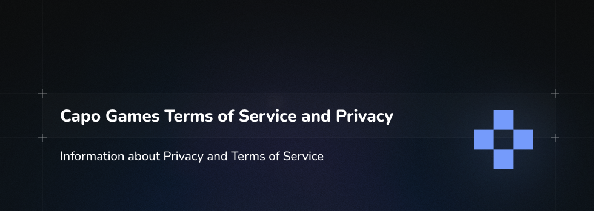

# Privacy

## Data We Collect

Rhythia is operated by CAPO GAMES and is built to collect as little data as possible.

We **do collect**:

- Internal **unique user IDs** (non-human-readable identifiers).
- Limited **gameplay and technical data** (e.g. scores, rankings, error logs, version info).
- Data strictly needed to run, secure, and improve the service under GDPR’s **legitimate interest** basis (where applicable).

We **do not collect**:

- Names, email addresses, phone numbers, postal addresses, payment data, or other traditional **PII**.
- Data for advertising, tracking across third-party sites, or selling to data brokers.

> Please do not include personal data in usernames, descriptions, or other UGC.

---

## GDPR, EU Users & Data Removal

- CAPO GAMES **does not operate in the European Union** and is therefore **not generally obligated** under GDPR to erase data for users **not originating from EU countries**.
- For users **originating from the EU/EEA**, and to the extent GDPR applies:
  - We will **remove or anonymize** their unique ID and all directly affiliated account data upon a valid erasure request.
  - This is subject to reasonable technical and legal limits.
- For **non-EU users**:
  - Data deletion requests are handled **at our discretion**.
  - There is **no GDPR obligation** for erasure for non-EU origin users.

---

## User-Generated Content (UGC) & Contact

When we process a valid erasure request:

- We **do remove/anonymize**:

  - The unique user ID associated with the account.
  - Account-linked gameplay/technical data tied to that ID (where feasible).

- We **do not automatically remove**:
  - **User-generated content (UGC)** such as beatmaps, levels, or other creations.
  - UGC may remain available to preserve game and community continuity.
  - Where possible, UGC is **detached from the user ID**, so it is no longer linked to a specific user.

For any privacy-related questions or data requests, please contact: **rhythiaa@gmail.com**.

# Terms Of Service

_Last updated: February 2, 2025_

These Terms of Service (“Terms”) govern your use of:

- The Rhythia website: **https://rhythia.com**
- The Rhythia game client
- Any affiliated services, infrastructure, or platforms

Collectively referred to as **“Rhythia”**.

By visiting and/or using Rhythia, you are acknowledging your full acceptance of, and agreement to be bound by, these Terms without modification.

As a condition of your use of Rhythia, you warrant that you will **not** use Rhythia or any content obtained from Rhythia for any purpose that is unlawful or prohibited by these Terms.

In addition to this policy, please also review and understand our **Privacy Policy**.

If you violate any of these Terms, your permission to use Rhythia automatically terminates.

---

## 1. Description of Service

Rhythia is operated by **CAPO GAMES** and provides, free of charge to end users:

- Online gameplay services
- Online rankings and listings
- Means of communication between users
- A platform for hosting user-created content, allowing other users to access uploaded content

Rhythia management makes **no guarantees** that any user-uploaded content or information is:

- Accurate
- Current
- Of substantial quality

Rhythia:

- Assumes no responsibility for whether objectionable content has been uploaded
- Assumes no responsibility for whether users have the rights to distribute uploaded content

---

## 2. Modifications to Terms of Service

Rhythia may change these Terms from time to time.

- Your continued use of the Service after changes are posted constitutes:
  1. Your acknowledgment of the modified Terms; and
  2. Your agreement to abide by and be bound by the modified Terms.

Failure to abide by the modified Terms may result in termination of your Rhythia Service.

---

## 3. Modifications to Service

Rhythia reserves the right, at any time and from time to time, to:

- Modify the Service
- Discontinue the Service

This may be done **with or without notice** to you.

Rhythia shall not be liable to you or any third party should Rhythia exercise its right to modify or discontinue the Service.

---

## 4. Disclaimer of Warranties

You expressly agree that use of the Service is at **your sole risk**.

- The Service is provided on an **“as is”** and **“as available”** basis.
- Any material and/or data downloaded or otherwise obtained through use of Rhythia’s services is done at **your own discretion and risk**.
- You will be solely responsible for any damage to your computer system or loss of data that results from the download of such material and/or data.

Except as expressly set forth on our sites, Rhythia disclaims **all warranties of any kind**, express or implied, including but not limited to:

- Any warranty of merchantability
- Fitness for a particular purpose
- Non-infringement
- Title

Rhythia makes **no warranty or representation** regarding:

- The results that may be obtained from the use of Rhythia’s services
- The accuracy or reliability of any information obtained through Rhythia’s services
- Any goods or services purchased or obtained through Rhythia’s services
- Any transactions entered into through Rhythia’s services
- Whether Rhythia’s services will meet any user’s requirements
- Whether the Service will be uninterrupted, timely, secure, or error free

---

## 5. Limitation of Liability

In no event shall Rhythia, its officers, directors, employees, or agents be liable to you for any:

- Direct
- Indirect
- Incidental
- Special
- Punitive
- Consequential

damages whatsoever resulting from any:

1. Errors, mistakes, or inaccuracies of content
2. Personal injury or property damage, of any nature whatsoever, resulting from your access to and use of our website
3. Any unauthorized access to or use of our secure servers and/or any and all personal information and/or financial information stored therein
4. Any interruption or cessation of transmission to or from our website
5. Any bugs, viruses, trojan horses, or the like, which may be transmitted to or through our website by any third party
6. Any errors or omissions in any content or any loss or damage of any kind incurred as a result of your use of any content posted, emailed, transmitted, or otherwise made available via the Rhythia website

---

## 6. Indemnity

You agree to defend, indemnify, and hold harmless:

- Rhythia
- Its parent corporation
- Officers
- Directors
- Employees
- Agents

from and against any and all claims, damages, obligations, losses, liabilities, costs, or debt, and expenses (including but not limited to attorneys’ fees) arising from:

1. Your use of and access to the Rhythia website or services
2. Your violation of any term of these Terms of Service
3. Your violation of any third-party right, including without limitation any copyright, property, or privacy right
4. Any claim that one of your User Submissions caused damage to a third party

---

## 7. User Submissions & Content Removal

You are solely responsible for your own **User Submissions** and the consequences of posting or publishing them.

In connection with User Submissions, you affirm, represent, and/or warrant that:

- You own or have the necessary licenses, rights, consents, and permissions to use and authorize Rhythia to use all patent, trademark, trade secret, copyright, or other proprietary rights in and to any and all User Submissions.

Rhythia:

- Does **not** endorse any User Submission or any opinion, recommendation, or advice expressed therein
- Expressly disclaims any and all liability in connection with User Submissions
- Reserves the right to **remove Content and User Submissions without prior notice**

---

## 8. Privacy

Rhythia values your privacy and the trust you place in our services.

- Rhythia’s services are free of charge.
- No prior registration is needed for the basic use of these services (unless explicitly required for specific features).

For any **privacy-related concerns**, please contact:

- **Email:** `rhythiaa@gmail.com`

Please also review our separate **Privacy Policy** for further details on how we handle data.

---

## 9. Proprietary Rights to Content

You acknowledge that content (the **“Content”**), including but not limited to:

- Text
- Software
- Music
- Sound
- Photographs
- Video
- Graphics
- Name references
- Other material

contained in sponsor advertisements, search results, or otherwise provided to or accessed by you via the Service by Rhythia is protected by:

- Copyrights
- Trademarks
- Service marks
- Patents
- Other proprietary rights and laws

You are permitted to use this Content **only as expressly authorized** by the Service and applicable law.

---

## 10. Contact

For any questions regarding these Terms of Service, please contact:

- **Email:** `rhythiaa@gmail.com`
